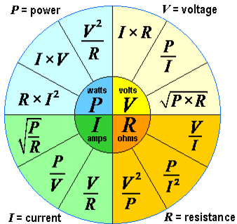
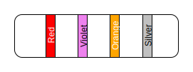

hero: 13 - Current Electricity

# Current Electricity

!!! Quote ""
    The rate of flow of charge in circuit is defined as current.
    $$ I=\frac{Q}{t} $$

* Electric current is equal to charge that flows in one second.
* Electric current is a scalar quantity.
* Unit of current is ampere in MKS system and stat ampere in CGS system.
* $1\text{ ampere}=$ $3\times10^9\text{ stat ampere}$
* $1\text{ ampere}=$ $6.25\times10^{18}\text{ electron}/\text{second}$
* Direction  of current is from higher to lower potential. The direction of current is the direction of flow of positive charge and opposite to the direction of flow of negative charge.
* In metals electric conduction takes place due to flow of free electrons only. But in gases and electrolytes electric conduction takes place due to flow of both positive and negative ions.

## Charge moving in Circle
If a charged particle of charge q is moving in circular path of radius $r$ with constant speed $v$ and constant frequency $f$ then
$$ \text{Current Produced }I=fq $$
or $$ I=\frac{vq}{2\pi r} $$
because $$ f=\frac{v}{2\pi r} $$

## Conventional Current & Electronic Current
| Conventional Current | Electronic Current |
|----------------------|--------------------|
| Current due to positive charges | Current due to negative charges |
| Flows from higher to lower potential | Flows from lower to higher potential |
| Flows along the direction of field | Flows against the direction of field |

* If both currents flow in a circuit then total current will be $I_{\text{total}}=I_{\text{+ve}} +I_{\text{-ve}}$

## Drift Velocity ($v_d$)

!!! Quote ""
    It is the average velocity attained by free electrons on applying external field. In conductors $v_d=10^{-3}ms^{-1}ms-1$

## Mean free path ($\lambda$)

!!! Quote ""
    It is the average distance moved by a free electron between two successive collision with stationary positive ions.

## Current Density ($J$)

!!! Quote ""
    The current flowing per unit normal area of cross section is defined as current density. i.e. $J=\frac{1}{A}$($amp~m^{-2}$). Current density is a vector quantity . Its direction is from higher potential to lower potential or its direction is that of the flow of positive charge. $J=nev_d$ where $v_d$ id the drift velocity of electron.

## Charge carriers
* In metallic conductors, charge carriers are electrons.
* In electrolytes, charge carriers are positive, negative ions.
* In gases, charge carriers are positive, negative ions.

* Current is only produced where there is a potential difference.
* Due to inelastic collision of free electrons under the action of potential difference  heat is produced.
* A steady current floes when a constant potential difference is maintained.

## Sources of Current
* It converts some kind of energy into electric current.
* Cells convert chemical energy into electrical energy.

| Name of device | Notable Feature |
|----------------|-----------------|
| Dry cell | Most commonly used |
| Primary Cell | Non-rechargeable |
| Secondary Cell | Rechargeable |
| Voltaic Cell | Convert chemical into electrical energy |
| Electric Generator | Convert mechanical into electrical energy |
| Solar Cell | Convert light into electrical energy |
| Thermocouple | Convert heat into electrical energy |

## Effects of Current

* Heating effect $H=I^2Rt$ as in heater.
* Magnetic effect as in transformer.
* Chemical effect as in electroplating.

## Ohm's Law
The current flowing through a conductor is directly proportional to the potential difference across its ends provided the physical states as temperature etc of the conductor remains constant.

Ohm's law expresses a relation between potential difference and current as given below $V=IR$

Where $R$ is known as resistance measured in ohms.

* Microscopic form of Ohm's law is given as $J=\sigma E$. Where $\sigma$ is conductivity.
* The metallic conductor that obey Ohm's law is called **ohmic conductor**. It $VI$ graph is straight line.
* The conductor that does not obey Ohm's law is called **non-ohmic conductors**. Its $VI$ graph is not straight line.

!!! info
    Metallic Conductors deviate  from their ohmic behaiour when subjected to high potential difference.

## Resistance & Resistivity

!!! Quote ""
    Opposition or hindrance to flow of current.
    $$ R=\frac{V}{I} $$

* Its SI unit is ohm ($\Omega$) that is defined as:

!!! Quote ""
    If $1V$ potential difference across a conductor produces $1A$ current then, resistance will be $1\Omega$

* Resistance arises due to collision between current carriers and vibrating ions.
* Resistance of a conductor depends on the following factors:
    * $R\propto L$
    * $R\propto 1/A$
    * $R\propto T$ (expect semi-conductors)
    * Nature of material
* **Resistivity** is a resistance of $1m$ cube of a substance. It is given by $$ \rho = \frac{RA}{L} $$ where $\rho$ is called Resistivity.
* We can say that $\rho=R$ if $A=1m^2$ and $L=1m$.
* Its SI unit is $\Omega m$

## Conductance & Conductivity
* Conductance is reciprocal of Resistance $\text{Conductance} = 1/\text{Resistance}$
* Its SI unit is $\text{mho}$ or $\text{siemen}$.
* Reciprocal of resistivity is called conductivity.
* Its SI unit is $(\Omega m)^{-1}$

## Temperature Coefficient of Resistance and Resistivity
!!! Quote ""
    Fractional change in resistance per degree change in temperature is called temperature coefficient of resistance. It is given as:
    $$ \alpha = \frac{R_t-R_{\omicron}}{R_{\omicron}\Delta T} = \frac{\Delta R}{R_{\omicron}\Delta T} $$
    or
    $$ R_t = R_{\omicron}(1+\alpha\Delta T) $$

!!! Quote ""
    Fractional change in resistivity per degree change in temperature is called temperature coefficient of resistivity. It is given as:
    $$ \alpha = \frac{\rho_t-\rho_{\omicron}}{\rho_{\omicron}\Delta T} = \frac{\Delta \rho}{\rho_{\omicron}\Delta T} $$
    or
    $$ \rho_t = \rho_{\omicron}(1+\alpha\Delta T) $$

* SI unit of coefficient of resistance or resistivity is $K^{-1}$.
* Temperature coefficient of conductors is helpful in differentiating them.
* If two conductors (e.g iron & platinum) have equal resistivity, even then they can be differentiated, by measuring their temperature coefficient of resistivity.

## Superconductivity
* When temperature of conductor falls the amplitude of vibrations of its lattice atoms decreases and hence resistance and resistivity both decrease.
* It is not possible to make resistance or resistivity equal to zero by falling temperature because ions retain their oscillations even at $0K$.
* Metallic conductors that show remarkable decrease in their resistance with fall of temperature are called **Superconductors**.
* The temperature at which a Superconductor losses its all resistance is called **critical temperature**. Denoted by $T_c$.
* Major problem with Superconductor is that they loose Superconductivity at room temperature.
* Virtue of Superconductivity is to save electrical energy in futue.
* Electrical energy would pass with zero loss through a Superconductor.
* Superconductivity is a quantum mechanical phenomenon.

## Combination of Resistances
| Series Combination | Parallel  Combination |
|--------------------|-----------------------|
| One path for current | More than one path for flow of current |
| Same current through each resistance | Different current through each resistance depending on its resistance |
| Different potential difference across each resistance | Same potential difference across each resistance |
| $R_{eq}$ is larger than the largest resistance | $R_{eq}$ is smaller than the smallest resistance in the circuit |
| $$ \displaystyle\sum^n_{i=1}R_i $$ | $$ \displaystyle\sum^n_{i=1}\frac{1}{R_i} $$ |

* In all combinations of resistors, law of conservation of energy and charge apply.

## Combinations of Bulbs
### Series
* Total Power consumed $\frac{1}{P_{total}}= \frac{1}{P_1} + \frac{1}{P_1} + ...$
* If $n$ bulbs are identical, $\frac{1}{P_{total}}= \frac{P}{n}$
* $P_{consumed}(\text{brightness})\propto$ $V\propto$ $R \propto \frac{1}{P_{rated}}$ i.e in series combination build of lesser wattage will give more bright light light and potential difference appeared across it will be more.

### Parallel
* Total power consumed $P_{total}=P_1+P_2+...$
* If $n$ identical bulbs are in parallel $P_{total}=nP$
* $P_{consumed}(\text{brightness})\propto$ $P_r\propto$ $I \propto I/R$ i.e parallel combination , bulb of greater wattage will give more bright light and more current will pass throught it.

#### Example
Two bulbs are working in parallel order. Bulb $A$ is brighter than bulb $B$. If $R_A$ and $R_B$ are their resistance respectively then

1. $R_A>R_B$
2. $R_A<R_B$
3. $R_A=R_B$
4. None of these

#### Solution
(2) In parallel $P_{consumed} \propto (\text{brightness}) \propto I/R$

$P_A>P_B$ (given) $R_A<R_B$

## Joule Thomson's Effect & Power Dissipation

!!! Quote ""
    When current flows through conductors, then a part of energy of current carriers transferred to ions on their way, due to which their amplitudes of vibrations increases which result in rise of temperature. the above phenomenon is known as **Joule Thomson's effect**.

    Hence electrical energy is wasted that is given by:
    $$ W=QV $$
    $$ P=\frac{W}{t} =\frac{QV}{t} $$
    $$ P=IV $$
    $$ P=I^2R $$
    $$ P=\frac{V^2}{R} $$
    Where $P$ represents the power dissipation.

* Heat produced due to power dissipation is given as:
$$ H=P\times t $$

$$ ~~~=I^2RT $$

$$ ~~~=VIt $$

$$ ~~~=V^2t/R $$

* If $1J$ electrical energy is dissipated per second, then power dissipated will be $1\text{watt}$. $1\text{watt}=1J/1s$
* Kilowatt-hour is a commercial unit of **electrical energy**. it is defined as:

!!! Quote ""
    When a power of $1KW$ is maintained through a circuit for $1hour$, then energy dissipation is $1KWh.$

    $$ 1KWh = 1000W\times 3600 \text{sec} $$

    $$ ~~~~~~ = 3.6\times 10^6 J $$

    $$ 1 J = 2.77\times10^{-7} KWh $$

## EMF

!!! Quote ""
    potential difference between its output terminals when either its internal resistance **is zero or no current is being drawn from it**.

* When charge carriers flow through a conductor, they loose their electrical K.E in doing work against resistance, loss of energy is compensated by source of **emf at same rate**.
* Every source of emf has its own resistance called **internal resistance**.
* Smaller is the internal resistance of a battery , better it will be a source of emf.
* **Terminal Potential** difference is a voltage between out put terminals of a source of emf when current is drawn from it
* We can relate emf ($\varepsilon$), terminal potential ($V_t$) and internal resistance ($r$) by the following equation:
 $$ \frac{\varepsilon}{V_t} = \frac{V_t+I_t}{\varepsilon-I_t} $$

!!! info
    There are fwe relations for comaring $V_t$ and $E$.

    * $V_t=\varepsilon$ if $I=0$ (open circuit)
    * $V_t=\varepsilon$ if $r=0$
    * $V_t<\varepsilon$ by a factor $Ir$ except when one battery charged the other emf is "cause" & potential difference is its "effect". Maximum power is delivered when $r=R$.

## Kirchhoff's Laws
### Kirchhoff's Current Law (KCL)
The sum of all the currents flowing towards a point is equal to the sum of all the currents flowing away from the point.

$$ I_1+I_2-I_3-I_4=0 $$

$$ \displaystyle\sum^n_{i=1}I_i=0 $$

* This rule is based on the fact that a charge cannot be accumulated at nay point in a conductor is a steady situation.
* This rule follows Law of conversation of Charges.

### Kirchhoff's Voltage Law (KVL)
The algebraic sum of potential changes in a closed circuit is zero.

* Loop is a branch of circuit that originates and terminates at the same point.

## Color Code for Carbon Resistors
| Color | Number | Color | Number |
|-------|--------|-------|--------|
| Black |    0   | Green      | 5 |
| Brown |    1   | Blue       | 6 |
| Red   |    2   | Violet     | 7 |
| Orange|    3   | Gray       | 8 |
| Yellow|    4   | White      | 9 |

* The order could be remembered by **BB Roy Goes British via Gujranwala**.
* The resistance are of fixed value but highly temperature dependent.

### Method of Designation

* By tolerance we mean the possible variation from the marked value.
    * For **silver color** tolerance is $\pm10\%$
    * For **gold color** tolerance is $\pm5\%$

#### Example

The value of resistance = (1st digit)(2nd digit)(No of 0s) $\pm$ (Tolerance)

$\qquad = 27~000\pm10$

## Rheostat
* It is a wire wound variable resistance consisting of bare magnine wire wound around an insulation cylinder.
* It works on the principle that change in kenght effect the value of resistance. $R\times l$.
* Its symbol in electrical circuits is

* Rheostat is used as a variable resistance as well as potential divider just like dimmer in electric fans and volume  control knob in radio set.

## Thermistors
### Features
* Non-metalic resistors
* Highly heat sensitive resistor
* Negative temperature coefficient of resistance
* Resistance decreases with increase of temperature
* Thermistors with positive temperature coefficient are also available

### Uses
* For vey accurate measurement of very low temperature near about $10K$ or $-263^{\omicron}C$
* As heat sensors because it converts change of temperature into electrical coltage.

## Wheatstone Bridge (WSB)
* WSB consists of 4 resistances $R_1$, $R_2$, $R_3$ and $R_4$ connected in loop or mesh of certain pattern.

* WSB is an accurate measuring instrument of resistance up to two decimal place.
* WSB is balance when its galvanometer shows no deflection even when keys are closed.
* Condition for balanced bridge is that current through galvanometer is zero. Voltage across the terminals of galvanometer will be equal.

### Principle
$$ \frac{R_1}{R_2}=\frac{R_3}{R_4} $$

* Unknown resistance is placed at $R_3$ or $R_4$.
* Practical form of WSB is **post office box** and **slide Wire Bridge** also called Meter Bridge.

## Potentiometer

!!! Quote ""
    It is a device which is used to compare and find unknown emf in a circuit drawing any current from circuit.

    

* Wire of potentiometer is **4m** long, made of high resistance wire (eureka).

### Uses
* Accurate measurement of potential difference

* Measurement of emf of a battery

* Comparing emf's of batteries
* Internal resistance of cell

### Principle
Voltage across any length of a wire of uniform area of cross section is directly proportional to its length when a constant flow through it $V\propto I$ and current is $I=E/R$

* The ratio of emf of two cells is equal to ratio of balancing lengths i.e. $$ \frac{E_1}{E_2} = \frac{I_1}{I_2} $$
