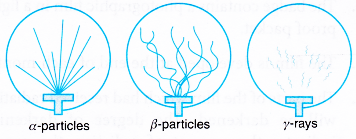
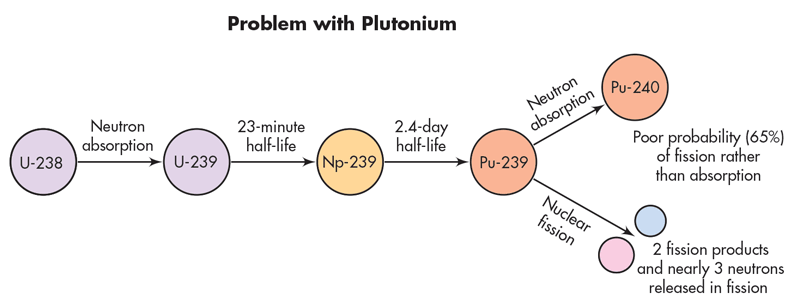

hero: 21 - Nuclear Physics

# Nuclear Physics

## JJ Thomson's Model of Atom
### Postulates
* Atom is a neutral as a whole, in which negative electrons are embedded on positive nucleus.
* Density of atom is uniform.
* There is no empty space in the atom.

### Objections
* There is no static equilibrium between electron and positive charge.
* Density of atom is not uniform.

## Rutherford's Atomic Model
### Postulates
* Most of the part of atom is empty.
* Central part is tiny and positively charged. It is called nucleus.
* Electrons are revolving about nucleus in circular orbits.
* Almost whole of mass is concentrated in nucleus (i.e. atom has non-uniform density).

### Objections
* The revolving electrons if moving continuously, will emit energy continuously.
* If energy is emitted continuously, then spectrum should be continuous but a line spectrum is obtained.
* If energy is emitted continuously, then atomic assembly will collapse

## Bohr's Atomic Model
### Postulates
* Electron can revolve only in those orbits in which its angular momentum is integral multiple of $\frac{h}{2\pi}$ $$ mvr =\frac{nh}{2\pi} $$ Such orbits are called allowed orbits or stationary state or Bohr's orbits.
* As long as an electron remains revolving in its allowed orbit, the energy of electron remains constant.
* When electron jumps down between two allowed orbits, it radiates energy in the form of photon of energy as given by $$ \Delta E=E_2-E_1=hf $$

### Objections
* Electronic orbits are not circular.
* Fine structure of atomic spectra could not be explained.
* Effect of nuclear motion on atomic spectra is not made clear.

## Nucleus & its Composition
* Nucleus is a tiny region in which almost all mass of atom is confined.
* Rutherford thought that whether nucleus is a lump of mass or it is an aggregate of particles.
* Size of atom is $10^{-10}m$ and that of nucleus is $10^{-14}m$.
* According to Rutherford's findings, nucleus is composed of neutron and proton, collectively known as nucleons, symbolized as: $_ZX^A$ Where $$ Z = \text{no. of electrons or protons in neutral atom} = \text{charge no.} $$ $$ A = \text{sum of proton and neutron in a nucleus} = \text{mass no.} $$ So, $$ \text{No. of neutron} = N = A - Z $$ In small atom $N=Z$, while in heavy atom $N>Z$.

## Discovery of Nucleons
* Proton (by Rutherford) $$ _2He^4 +_7N^{14} \to _8O^{17} + _1H^1 $$
* Neutron (by Chadwick) $$ _2He^4 + _4Be^9 \to _6O^{12} + _on^1 $$
* Hydrogen (simple hydrogen) is the only atom whose nucleus contains no neutron.
* According to modern research, the number of particle ousting in nucleus is 37.
* Mass of nucleus is roughly equal to sum of masses of nucleons.
* Unit of mass at atomic level is amu $$ 1 amu = 1.66\times10^{-27} kg $$
* Masses of some well known particles on amu scale are:

| Particle | Symbol | Mass in amu |
|----------|--------|-------------|
| Electron | $_{-1}e^0$ | 0.00055  |
| Proton   | $_1H^1$    | 1.007276 |
| Neutron  | $_on^1$    | 1.008665 |
| Deuteron | $_1H^2$    | 2.014102 |
| Helium nucleus | $_2H^4$ | 4.003603 |

!!! info
    We can calculate number of neutrons in a nucleus by simply subtracting mass number and atomic number like: $$ _{92}U^{235} \to 235-92=143 $$ So this nucleus contains 143 neutrons.

* $1 amu=931 MeV$ $\;\;\;$ $\implies$  $\;\;\;$  $1.66\times10^{-27}kg =931MeV$

## Isotopes
* Isotopes are such nuclei of an element having the same atomic number but different mass number.
* Isotopes have same number of protons.
* They have different number of neutrons.
* Isotopes of an element have the same chemical but different physical properties.

## Mass Spectrograph
Mass spectrograph is an electromagnetic instrument used for the measurement of masses of isotopes.

### Principle
$$ r\propto \sqrt{m} $$

* Radius of path described by charges ion is mass spectrometer is given as: $$ r=\sqrt{\frac{2Vm}{B^2e}} $$ Where $$ V=\text{Potential difference} $$ $$ e=\text{charge} $$ $$ B=\text{Magnetic field} $$

* Mass spectrograph sorts out positive ions.
* Centripetal forces of the magnetic field provide the isotopes a suitable radius to bend about.

## Nuclear Forces
* Nucleus contains protons that repel each other, may cause the destruction of nucleus.
* There are two classical forces, operating in nucleus.

* Coulomb's repulsive force: $$ F_{e}=\frac{K e^2 }{r^2} $$
* Newton's attraction force: $$ F_{g} =\frac{G m^2 }{r^2} $$

* Classical forces are unable to give stability to the nucleus. Due to strong repulsive forces in nucleus, it requires much energy for the entry of another charged particles e.g. proton.

!!! info "For Example"
    7.2 MeV energy is required to the addition of 1 proton into a nucleus of 50 protons

* A force, which has binding effect on nucleons to give stability of nucleus, is called strong nuclear force.

### Properties of Strong Nuclear Force
* It does not obey inverse square law.
* It is the strongest force having range equal to nuclear diameter 10.14m.
* It is always attractive force and has binding effect inside the nucleus.
* Strong nuclear force is attractive only within nucleus while a strong force of repulsion is outside the nucleus because of coulomb's repulsive force.

## Mass Defect
* Mass defect is the difference between mass of nucleus and sum of masses of its nucleons. $$ \Delta m = \text{sum of masses of nucleons} - \text{mass of nucleus} $$ e.g. for deuterium ($_{1}H^2$), $\Delta m = 0.002388 amu$
* Mass defect $\Delta m$ is converted into energy $\Delta mc^2$ called binding energy. It is liberated in the form of photon. $$ E = Am x 931MeV = [(Z mp - N mp) - m] x 931MeV $$
* After liberation of binding energy (E = A mc2), the nucleus becomes stable e.g. BE for deuterium is 2.24 MeV.
* When energy equal to binding energy is provided to nucleus, somehow, the nucleus dissociates into nucleons.
* Binding energy can be given as energy required to dissociate nucleus into nucleons.
* Graph between mass number (A) and B E per nucleon is shown below:

* The following conclusions can be drawn from the above curve:
    * Binding energy of a light atom is very large that is why they are stable. (max value is at A56).
    * Binding energy of large atoms is smaller that is why they are less stable.
    * The binding energy increases with increasing Atomic mass. Binding energy decreases with increase in atomic mass if atomic number > 82.
    * The binding energy per nucleon is maximum for iron.
* $\Delta m/A$ is called packing fraction.

## Radio Activity
* Becquerel discovered radioactivity.
* Nuclei having $Z>82$ are unstable and they emit $\alpha$, $\beta$ or $\gamma$ rays, this is called radioactivity.
* Some radioactive elements are $_{84}Po$, $_{88}Rd$ and $_{92}U$

### $\alpha$-decay
Charge no. ($Z$) decreases by 2 and mass no ($A$) by 4:

$$ _ZX^A \longrightarrow _{Z-2}Y^{A-4} +_{2}He^{4} + Q $$

For Example
$$ _{92}X^{238} \longrightarrow _{90}Y^{234} + _{2}He^{4} + 4.3 MeV $$

### $\beta$-particle
$\beta$-particle is electron or positron coming from nucleus. So it may be classified as:

#### $\beta^-$-decay
$$ _ZX^A \longrightarrow _{Z+1}Y^{A} +_{-1}\beta^{0} + v^+ $$

Only charge number (Z) increases by 1.

Its prototype is decay of neutron itself that changes to $p$ and $_{-1}e^0$ $$ _0^1n \longrightarrow _{Z+1}Y^{A} + _{-1}\beta^{0} + v^+ $$

For Example
$$ _{11}Na^{24} \longrightarrow _{12}Mg^{24} + _{-1}\beta^{0} + v^+ $$

#### $\beta^+$-decay
$$ _ZX^A \longrightarrow _{Z-1}Y^{A} +_{+1}\beta^{0} + v^- $$

Only charge number (Z) decreases by 1.

Its prototype is decay of proton itself that changes to $n$ and $_{-1}e^0$.

$$ _1^1p \longrightarrow _{0}^1n + _{+1}\beta^{0} + v^- $$

For Example
$$ _{9}F^{17} \longrightarrow _{8}O^{17} + _{-1}\beta^{0} + v^+ $$

!!! note
    Weak interaction only appears in $\beta$-decay.

### $\gamma$-decay
$\gamma$-decay is due to de-excitation of nucleus.

$$ _zX^A \longrightarrow _ZX^A+ \gamma $$

'*' show excitation of atom.

$$ _{38}^{87}Sr^{*} \longrightarrow _{38}^{87}Sr+ \gamma- \text{photon} $$

$$ _{12}^{27}Mg \longrightarrow _{13}^{27}Al^{*}+ _{-1}^0\beta + V $$

$$ _{13}^{27}Al^{*} \longrightarrow _{13}^{27}Al+ \gamma- \text{photon} $$

| Type of Radiation | Alpha Particle | Beta Particle | Gamma ray |
|-------------------|----------------|---------------|-----------|
| **Symbol** | $\alpha$, $_2^4\alpha$ or $_2^4He$ | $_{+1}\beta^0$ or $_{-1}\beta^0$ | $\gamma$ |
| **Mass (amu)** | $4$ | $1/2000$ | $0$ |
| **Charge** | $+2$ | $-1$ or $+1$ | $0$|
| **Speed** | slow | fast | very fast (speed of light) |
| **Ionization ability** | high | medium | 0 |
| **Penetration power** | low | medium | high |
| **Stopped by** | paper | aluminium | lead |

## Half Life of Elements
* Radioactive decay is a random process so we get idea of half-life.
* The half-life $T_{1/2}$ of a radioactive element is that period in which half of the atoms decay.
* Half-life ($T_{1/2}$) depends on element and is not affected by any physical change or chemical change.
* Half-life may be classified as follows:
    1. Extremely short half-life: $T_{1/2}$ in micro or nano seconds
    2. Moderate half-life: $T_{1/2}$ in minutes.
    3. Long half-life: $T_{1/2}$ in years
* Half life can be given as: $$ T_{1 /2} = 0.693 / \lambda $$ Where $\lambda$ is called decay constant depends upon nature of material. Decay constant of any element is equal to the fraction of the decaying atoms per unit time. The unit of the decay constant is $s^{-1}$.
* The decay curve shows that radioactive element decay exponentially
* Half-life is used to identify an atom.

## Laws of Radioactivity
* $\Delta N/\Delta t\propto N_o$
* $\Delta N/\Delta t=-\lambda N_o$
* $N_t=e^{-\lambda_t}N_o$
* $T_{1/2}\propto 1/\lambda$
* $\lambda=\frac{\Delta N/\Delta t}{N}$
* Mean life $=T=1/\lambda$

## Interaction of Radiation with Matter
$\alpha$, $\beta$ and $\gamma$ rays are called nuclear radiations.

Interaction of nuclear radiations with matter depends on following characteristics of nuclear radiations:
* Mass of particle
* Charge of particle
* Energy of particle
* Density of the medium
* Ionization potentials of the atoms of the medium

## Interaction of $\alpha$-rays
* $\alpha$-particle can do ionization in following two ways
    1. Mechanical collision ($\alpha$-particle directly hits electron)
    2. Coulomb's interaction (electrostatic interaction)
* Mode of ionization by Coulomb's interaction (electrostatic attraction) for $\alpha$-rays dominates over that by direct collision.
* The path of ionization followed by a-rays is straight and continuous because of its high ionization power and large mass.
* During ionization, $\alpha$-particle continuously looses its energy as a result of which its velocity decreases.
* $7.7MeV$ $\alpha$-particle produces $2\times10^5$ ion pairs before stopping in average.
* When $\alpha$-particle has spent all its energy on ionization it absorbs two electrons from its surroundings gas and becomes a neutral (He atom).
* Range of $\alpha$-particle in air is small due to intense ionization.
* $7.7MeV$ $\alpha$-particle has $7cm$ range in air at S.T. P, which reduces further in denser medium.
* Range of $7.7MeV$ $\alpha$-particle in aluminum is only $0.04mm$.
* $\alpha$-particle produces disintegration in nuclei of some atoms if they have high energy.

## Interaction of $\beta$-rays
* $\beta$-particles are fast electrons or positrons coming from nucleus.
* Range of $\beta$-particle is larger than that of $\alpha$-particle by a factor of 100.
* Ionization of $\beta$-particle is smaller than that of $\alpha$. (100 times less)
* Mass of $\beta$-particle is equal to that of an electron.
* Charge of $\beta$-particle is equal to $1.6\times10^{-19}C$ that may be positive for positron ($\beta_{+1}^o$) and negative for electron ($\beta_{-1}^0$).
* $\beta$-Particle does ionization due to electrostatic repulsion (in case of $\beta^-$ and attraction (in case of $\beta^+$).
* Ionization path of $\beta$ is broken and zigzag due to its smaller mass,
* Ionization by head-on-collision is very rare.
* $\beta$-particle looses almost all its energy in a single encounter.
* Because of lesser ionization encounters, penetration of $\beta$ is 100 times than that of $\alpha$-particle of same energy.
* $3MeV$ $\beta$-particle can pass through $6.5mm$ aluminum foil.
* $\beta$-particle can produce fluorescence.

## Interaction of $\gamma$-rays
* $\gamma$-rays being photons can't be stopped by matter (lead can be used as a shield because of its high electron density)
* $\gamma$-rays have shorter wavelength than X-rays.
* $\gamma$-particles loose their energy by following three ways.
    1. Compton effect
    2. Photoelectric effect
    3. Pair production.
* The type of interaction depends upon energy range of photon available according to following scheme:

| Energy Range | Type of Interaction |
|--------------|---------------------|
| $E<0.1 MeV$  | Photoelectric effect |
| $E=0.1Mev$ to $1Mev$ | Compton effect |
| $E>1.02 MeV$ | Pair Production     |

## Interaction of Neutrons
* Neutrons are more effective radiation than both $\alpha$ and $\beta$ rays because they bear no charge as regard to penetration.
* When neutron is captured by a nucleus, it results in the formation of a radioisotope.
* Neutron causes fission in heavy nuclei.
* Neutron can knock down electrons out of body cells causing instantaneous death

| Radiation | Description | Penetration | Ionization | Effect of $E$ or $B$ field |
|-----------|-------------|------------|-----------|---------|
| Alpha ($\alpha$) | Helium nucleus $$ 2p+2n $$ $$ Q=+2e $$ | Few cm in air or in paper | Intense, about $10^8$ ion pairs per mm. | Slight deflection as a positive charge. |
| Beta ($\beta$) | High speed electron $$ Q=-1e $$ | Few mm in aluminum | Less intense than $\alpha$, about $10^2$ ion pairs per mm. | Strong deflection in opposite direction to $E$ |
| Gamma ($\gamma$) | Very short wavelength $Em$ radiation | several cm in lead, couple of m in concrete | Weak interaction about 1 ion pair per mm | No effect |

## Wilson Cloud Chamber
* C.T.R Wilson in 1911 invented Wilson cloud chamber.
* Wilson cloud chamber is based upon the following principle:

> Super saturated droplets prefer to condense on ions or dust particles similar to formation of clouds.

### Construction
It consists of a circular base metal plate with hole in the center. Above it, is another metal plate with a black felt pad. A Perspex or glass dome fits over the two plates with the source on its top.

### Procedure
Due to adiabatic expansion, the super-saturated droplets are produced. When nuclear radiation enters, it produces ionization and water vapours condense on such ions. They reflect light to make the path of ionizing particles visible. A high speed camera photographs the track of ionizing particle.

### Track of ionizing Particle
| Name of Particle | Shape of Track |
|------------------|----------------|
| $\alpha$-particle | Solid & continuous |
| $\beta$-particle | Zigzag & discontinuous |
| $\gamma$-particle | No definite track |

* By applying magnetic field, the $\alpha$ & $\beta$ particles deviate from its original path.
* By measuring radii of curvature, we can also measure e/m ratio of $\alpha$ & $\beta$ particles.
* Length of cloud tracks is proportional to energy

## Geiger-Muller Counter
* Geiger and Muller invented G.M counter (Geiger - Muller counter).

### Construction
G.M counter consists of a metal tube (cathode) containing inert gas (such as argon & alcohol or bromine and neon) at 0.1 atmospheric pressure. There is a thin win (anode) co-axial with metallic tube.

### Procedure
* When nuclear radiation enters, it produces ionization in halogen gas ions.
* Positive ions move towards negative metallic plate while negative ions towards positive wire.
* Electrons released by nuclear radiation rush towards the positive wire knocking electrons from atoms of gas in their way. In this way an avalanche of electrons reach the wire and hence current pulse is produced.
* The current pulse is detected across a resistance of $10^9\Omega$.

## Quenching of Discharge
Positive ions on reaching the metal tube pull out electrons. These electrons van excite the atoms, which on returning to ground state emit photons, which than ejects photoelectrons under photoelectric effect, To avoid photoelectrons, We do quenching.

Quenching of discharge in G.M counter is attained by following two ways:

* **Manual quenching:** by lowering voltage below critical value of discharge.
* **Self-quenching:** by adding bromine gas into principal gas (neon) The mechanism is such that the 1:E of bromine is lower than neon, the ions of quenching gas reach the cathode before principal gas ions. When they reach near the cathode, they capture electron and become neutral molecules. Following neutralization, the excess energy of the quenching molecules is dissipated in dissociation of the molecules rather than in the release of electrons from the cathode.
* G.M counter can be used to study $\beta$ and $\gamma$-rays effectively.
* It can't detect $\alpha$-particles.

## Solid State Detector
* Solid State detector is most sensitive detector capable of detecting three $\alpha$, $\beta$ & $\gamma$-rays.

### Construction
Solid State detector mainly consists of reverse biased diode.

### Procedure
When radiation falls on the diode, it causes the release of electrons, creating some sort of conduction path. The voltage caused due to flow of electrons is measured.

### Advantages
* Compact size
* Very fast detector
* No need of quenching
* Portable
* Can detected $\alpha$, $\beta$ & $\gamma$-rays.
* Low energy utilization (requires $3eV - 4eV$ of energy)

## Nuclear Fission
* Otto Hahn and his co-workers discovered nuclear fission accidentally when they were attempting to prepare transuranic elements by bombarding $U_{92}^{238}$ with $n_0^1$ (slow).
* Transuranic elements are those elements that have atomic no. greater than that of uranium (the heaviest natural element) e.g. Np (Z=93), Pu (Z=94) etc.
* There are 30 different ways by which nucleus can undergo fission accompanied by 2 to 5 neutrons (average is 2.5 neutrons).
* Fission neutrons are ejected by daughter or fission fragment, not by parent nucleus.
* During fission, 99 percent neutrons are ejected in extremely short time and are called prompt neutrons, the remaining 1% are emitted a litter latter. They are called delayed neutrons.
* Unstable fission fragments, to become stable, eject delayed neutrons.

## Isotopes of Uranium
| Ore | Percentage | Half-life |
|-----|------------|-----------|
| $_{92}U^{238}$ | $99.38$% | $4.51\times10^9$ years |
| $_{92}U^{235}$ | $0.72$% | $7.04\times10^8$ years |
| $_{92}U^{234}$ | $0.006$% | $2.4\times10^5$ years |

* For fission of $U^{238}$ $n^1$ of energy $1MeV$ is required while for $U^{235}$ $n^1$ energy $0.04eV$ is required.
* Two common fission reactions for uranium are as follows:

$$ _0n^1+_{92}U^{235} \longrightarrow _{86}Ba^{141} +_{36}Kr^{91}+ 3_0n^1+200MeV(Q) $$

$$ _0n^1+_{92}U^{235} \longrightarrow _{54}Xe^{140} +_{38}Sr^{94}+ 2_0n^1+200MeV $$

## Types of  Fission
1. **Controlled fission chain reaction:** In this reaction only one neutron, out of all the neutrons created in one fission reaction, becomes the cause of further fission reaction. It is the underlying principal of nuclear reactor.
2. **Critical mass:** Such a mass of uranium in which one neutron, out of all the neutrons produced in one fission reaction, produces further fission is called critical mass.
3. **Uncontrolled fission chain reaction:** If the mass of uranium is much greater than the critical mass, then the chain reaction proceeds at a rapid speed and a huge explosion is produced. Atom bomb works at this principal

  * Fermi carried out first controlled fission in 1942.
  * Fission of $_{92}U^{235}$ atom releases $10^8$ times as much energy as is released by atom in ordinary furnace.
  * 1 kg of $_{92}U^{235}$ contains $\implies (1000g/235)\times 6.023\times 10^{23}$ $=25.6 \times 10^{23}$ atoms.   We know that, $$ 1 \text{ atom of } _{92}U^{238} \text{ gives } \implies 200 MeV $$  $$ 1 kg \text{ of } _{92}U^{235} \text{gives} \implies 5.12 \times 10^{26} MeV $$ We know that, $$ \text{Time for one fission }= 10^{-8} s $$  $$ \text{Time for 60 fissions} = 0.6\mu s $$ Thus $5\times 10^{26}MeV$ energy is liberated in $0.6\mu s$ when 1 kg of $_{92}U^{235}$ undergoes, complete fission.
  * Plutonium-239 and uranium-233 are also being used as fuel.

## Nuclear Reactor
Fission chain reaction can be controlled in a device called nuclear reactor.

* Nuclear reactor works according to the principle that the environment of nuclear reactor is controlled in such a way that only one slow neutron take part in fission process at a time.

## Parts of Nuclear Reactor
* **Fuel rods:** $U^{235}$ is used as fuel. In this fuel of the quantity of $U^{235}$ is increased from 2 to 4%.
* **Control rods:** $Ba$ or $Cd$ rods absorb neutrons efficiently.
* **Moderator:** to slow down neutrons usually graphite.
* **Heat Exchanger:** to convey the energy produced fro the sake of use.
* **Cooling System:** to avoid over heating.
* **Core:** consists of fuel, control rods and moderator.
* **Biological Shield:** to prevent scattering of harmful radiations.
* **Breeding:** Breeder nuclear reactor is that which prepare its fuel bu itself.

## Types of Nuclear Reactors
### Thermal Reactor
* Neutrons must be slowed down to thermal energies to provide fission.
* In this reactor $U^{235}$ is used as fuel.

### Fast Reactor
* Fast neutrons are used to strike $U^{238}$ producing $Np^{239}$ and then $Pu^{239}$. This type of reactor is liquid fast breeder reactor (**LMFBR**)
* LMFBR produces Plutonium according to following scheme:

| Thermal Reactor | LMFBR |
|-----------------|-------|
| Moderator | No Moderator |
| Coolant is ordinary water or gas | $Na$ is coolant |
| Run continuously | Requires maintenance after 15 days |
| Uses $U^{235}$ as fuel | Uses $U^{238}$ as fuel |

**To be completed...**